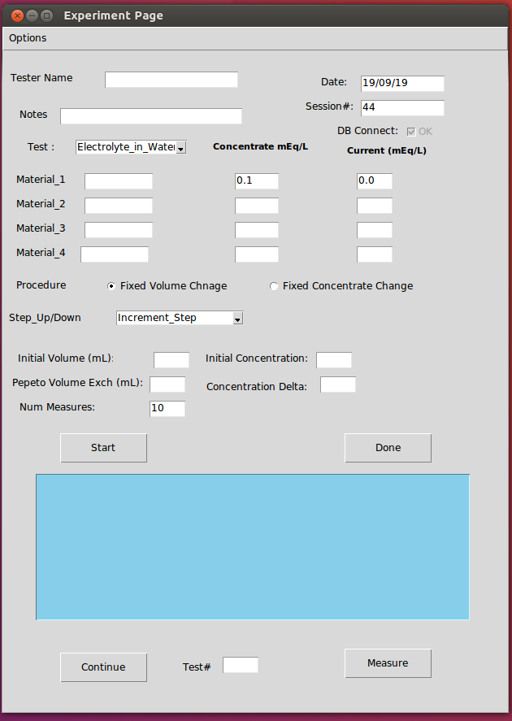

# labDataTool

The lab tool provides a GUI interface for opration of a spectrum experiment using a RF Vector-Network Analyzer (VNA) Machine. The tool enables (I) Remote-operation of an RF Vector Network Analyzer (VNA) Machine, (II) Documentation and storage of experiment conditions and measurement results through the use of a main Data-Base (DB) (III) Data Analysis of of data acquired and stored in the DB.  The software runs on a Host PC, and enable semi-automatic/operator controlled  acquisition of  measurements from the VNA. 

## Tool GUI Interface 

The control interface includes a GUI page with various setup parameters of the experiment and document the (Device Under Test) DUT conditions. The GUI controls and procedures for performing an experiment is defined shown the following:

